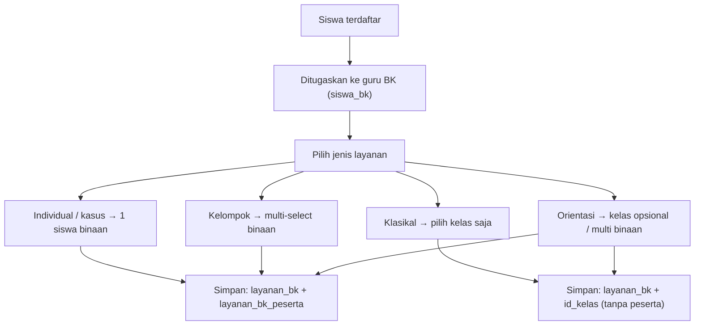
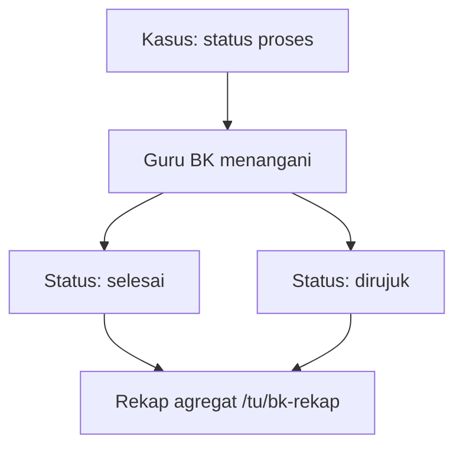

# Rencana Implementasi Modul Bimbingan Konseling (BK) — v2.1

## Overview

Modul BK ditambahkan ke dalam e-Rapor SMK Abdi Negara Tuban untuk memfasilitasi
layanan bimbingan konseling oleh guru BK. Modul ini hanya bisa diakses oleh
guru yang memiliki flag `moto = 1` di tabel `users`.

**Perubahan dari v1:**
- `layanan_bk` dipecah menjadi sesi + peserta agar mendukung layanan kelompok/klasikal secara benar
- Tambah `bidang_bimbingan` (pribadi, sosial, belajar, karir) sesuai kaidah BK standar (POP BK/ABKIN)
- Tambah `status` kasus untuk melacak siklus penanganan
- Tambah akses supervisi read-only (rekap agregat) untuk TU Admin
- Tambah `ruangan` pada jadwal
- Catatan kerahasiaan data ditambahkan sebagai prinsip desain

**Perubahan v2.1 (post-analisis codebase):**
- Flag `moto` harus bisa di-set dari form Pegawai TU (sebelumnya hanya tampil, tidak editable)
- Rekap supervisi dipindah ke `/tu/bk-rekap` (bukan `/kepsek/*` — route kepsek tidak ada di project)
- Layanan `klasikal`/`orientasi`: cukup catat `id_kelas`, tanpa wajib isi `layanan_bk_peserta`
- Layout guard `/guru/bk/layout.tsx` cegah akses URL langsung oleh guru non-BK
- `saveLayananBK()` pakai transaksi DB; `moto` diseragamkan ke numeric `1/0`
- Dashboard MVP: stat cards + bar CSS (tanpa library chart — belum ada di `package.json`)

> **Catatan naming:** Modul ini "Bimbingan Konseling" (sidebar section terpisah). Jangan dicampur dengan **P5BK** (`/guru/p5bk`) yang modul Proyek Penguatan Profil Pelajar Pancasila dan Budaya Kerja.

---

## 0. Prasyarat — Toggle Guru BK di Pegawai TU

Kolom `moto` sudah ada di DB dan ditampilkan di tabel pegawai, tapi **belum bisa di-edit** dari UI. Step ini wajib sebelum modul BK bisa dipakai operasional.

### `src/app/(dashboard)/tu/pegawai/_components/modal-pegawai.tsx`

Tambah checkbox di form (hanya tampil jika `jabatan = 3` / Guru):

```tsx
<label className="flex items-center gap-2">
  <input
    type="checkbox"
    name="moto"
    value="1"
    defaultChecked={pegawai?.moto == 1}
    className="rounded border-gray-300"
  />
  <span className="text-sm font-medium text-[#1A1A2E]/80">Guru Bimbingan Konseling (BK)</span>
</label>
```

### `src/lib/actions/pegawai-actions.ts`

Baca `moto` dari FormData dan simpan ke DB:

```typescript
const moto = formData.get('moto') === '1' ? 1 : 0;

// Pada UPDATE, tambahkan 'moto = ?' ke fields + values
// Pada INSERT, ganti hardcoded `0` dengan variabel moto
```

**Konvensi:** pakai numeric `1/0` konsisten dengan query di `tu/pegawai/page.tsx` (`u.moto = 1`).

---

## 1. Database Schema (4 Tabel Baru)

Migration: `migrations/0005_add_bk_tables.sql` (idempotent, pakai `CREATE TABLE IF NOT EXISTS`).

### 1.1 `siswa_bk` — Penugasan Siswa ke Guru BK

```sql
CREATE TABLE IF NOT EXISTS `siswa_bk` (
  `id_siswa_bk` int(10) NOT NULL AUTO_INCREMENT,
  `tahun` int(10) NOT NULL,
  `semester` int(10) NOT NULL,
  `id_user` int(10) NOT NULL COMMENT 'Guru BK (users.moto=1)',
  `id_siswa` int(10) NOT NULL,
  `created_at` datetime DEFAULT CURRENT_TIMESTAMP,
  `deleted_at` datetime DEFAULT NULL,
  PRIMARY KEY (`id_siswa_bk`),
  UNIQUE KEY `uniq_siswa_periode` (`tahun`, `semester`, `id_siswa`),
  KEY `id_user` (`id_user`),
  KEY `id_siswa` (`id_siswa`)
) ENGINE=InnoDB DEFAULT CHARSET=utf8mb4;
```

**Catatan:**
- Satu siswa hanya ditugaskan ke satu guru BK per periode
- Guru BK ditentukan dari `users.moto = 1`

> **UNIQUE + soft delete:** Terapkan validasi aplikasi (`deleted_at IS NULL`) sebelum insert, dan **hard delete** baris soft-deleted saat re-assign (lihat `addSiswaBinaan()`).

### 1.2 `layanan_bk` — Sesi Layanan Konseling (Header)

```sql
CREATE TABLE IF NOT EXISTS `layanan_bk` (
  `id_layanan` int(10) NOT NULL AUTO_INCREMENT,
  `tahun` int(10) NOT NULL,
  `semester` int(10) NOT NULL,
  `id_user` int(10) NOT NULL COMMENT 'Guru BK pemberi layanan',
  `jenis_layanan` enum('individual','kelompok','klasikal','kasus','orientasi') NOT NULL DEFAULT 'individual',
  `bidang_bimbingan` enum('pribadi','sosial','belajar','karir') NOT NULL,
  `id_kelas` int(10) DEFAULT NULL COMMENT 'Wajib jika jenis_layanan = klasikal; opsional untuk orientasi',
  `tanggal` date NOT NULL,
  `judul` varchar(255) NOT NULL,
  `uraian` text NOT NULL,
  `tindak_lanjut` text DEFAULT NULL,
  `status` enum('proses','selesai','dirujuk') NOT NULL DEFAULT 'proses',
  `created_at` datetime DEFAULT CURRENT_TIMESTAMP,
  `deleted_at` datetime DEFAULT NULL,
  PRIMARY KEY (`id_layanan`),
  KEY `id_user` (`id_user`),
  KEY `tahun_semester` (`tahun`, `semester`),
  KEY `id_kelas` (`id_kelas`)
) ENGINE=InnoDB DEFAULT CHARSET=utf8mb4;
```

### 1.3 `layanan_bk_peserta` — Peserta per Sesi (Detail)

```sql
CREATE TABLE IF NOT EXISTS `layanan_bk_peserta` (
  `id_layanan` int(10) NOT NULL,
  `id_siswa` int(10) NOT NULL,
  PRIMARY KEY (`id_layanan`, `id_siswa`),
  KEY `id_siswa` (`id_siswa`),
  CONSTRAINT `fk_lbp_layanan` FOREIGN KEY (`id_layanan`) REFERENCES `layanan_bk` (`id_layanan`)
) ENGINE=InnoDB DEFAULT CHARSET=utf8mb4;
```

**Kenapa dipisah:** Satu sesi kelompok = 1 baris header + N baris peserta, bukan N baris duplikat.

**Aturan penggunaan per jenis:**

| Jenis | `id_kelas` | `layanan_bk_peserta` | Validasi binaan |
|-------|-----------|----------------------|-----------------|
| `individual` | NULL | 1 baris | Wajib siswa binaan |
| `kasus` | NULL | 1 baris | Wajib siswa binaan |
| `kelompok` | NULL | 2+ baris | Semua peserta wajib binaan |
| `klasikal` | **Wajib** | **Kosong** (cukup `id_kelas`) | Tidak perlu — target = seluruh kelas |
| `orientasi` | Opsional | 0 baris (jika `id_kelas` diisi) atau multi-select binaan | Bebas |

> **Keputusan klasikal/orientasi:** Tidak isi `layanan_bk_peserta` per siswa — cukup `id_kelas`. Jumlah peserta di UI dihitung dari `COUNT(siswa_kelas)` untuk kelas tersebut. Menghindari insert ratusan baris dan konflik validasi binaan.

### 1.4 `jadwal_bk` — Jadwal Layanan BK

```sql
CREATE TABLE IF NOT EXISTS `jadwal_bk` (
  `id_jadwal` int(10) NOT NULL AUTO_INCREMENT,
  `tahun` int(10) NOT NULL,
  `semester` int(10) NOT NULL,
  `id_user` int(10) NOT NULL COMMENT 'Guru BK',
  `id_kelas` int(10) NOT NULL,
  `hari` enum('Senin','Selasa','Rabu','Kamis','Jumat','Sabtu') NOT NULL,
  `jam_mulai` time NOT NULL,
  `jam_selesai` time NOT NULL,
  `ruangan` varchar(100) DEFAULT NULL,
  `deleted_at` datetime DEFAULT NULL,
  PRIMARY KEY (`id_jadwal`),
  KEY `id_user` (`id_user`),
  KEY `id_kelas` (`id_kelas`)
) ENGINE=InnoDB DEFAULT CHARSET=utf8mb4;
```

---

## 2. File Structure

```
src/app/(dashboard)/guru/bk/
├── layout.tsx                        # Auth guard: jabatan=3 + moto=1
├── page.tsx                          # Dashboard BK (ringkasan)
├── _components/
│   ├── bk-dashboard-client.tsx       # Client: stat cards + bar CSS
│   ├── siswa-binaan-client.tsx       # Client: daftar siswa binaan
│   ├── layanan-bk-client.tsx         # Client: daftar layanan + form tambah
│   └── jadwal-bk-client.tsx          # Client: jadwal BK
├── siswa-binaan/
│   └── page.tsx
├── layanan/
│   ├── page.tsx
│   └── [id]/page.tsx                 # Detail sesi (uraian lengkap + peserta)
└── jadwal/
    └── page.tsx

src/app/(dashboard)/tu/bk-rekap/
└── page.tsx                          # Rekap agregat BK (read-only, TU Admin)

src/lib/actions/bk-actions.ts         # Server actions BK guru
src/lib/actions/bk-rekap-actions.ts   # Server action rekap agregat (supervisi)
src/types/index.ts                    # Interface baru
src/components/layout/sidebar-guru.tsx
src/components/layout/sidebar-tu.tsx  # Menu "Rekap BK"
src/app/(dashboard)/tu/pegawai/_components/modal-pegawai.tsx  # Toggle moto
src/lib/actions/pegawai-actions.ts    # Simpan moto
```

---

## 3. Auth Guards

### 3.1 Layout guard guru BK — `src/app/(dashboard)/guru/bk/layout.tsx`

Cegah akses URL langsung oleh guru non-BK (server actions saja tidak cukup):

```typescript
import { auth } from '@/lib/auth';
import { redirect } from 'next/navigation';
import { pool } from '@/lib/db';

export default async function BKLayout({ children }: { children: React.ReactNode }) {
  const session = await auth();
  if (!session?.user || session.user.jabatan !== 3 || !session.user.id_user) {
    redirect('/login');
  }

  const [rows]: any = await pool.query(
    `SELECT 1 FROM users WHERE id_user = ? AND moto = 1 AND deleted_at IS NULL LIMIT 1`,
    [session.user.id_user]
  );
  if (rows.length === 0) redirect('/guru');

  return <>{children}</>;
}
```

### 3.2 Helper server action — `requireBKGuru()`

```typescript
async function requireBKGuru() {
  const authResult = await requireGuru();
  if (authResult.error || !authResult.user?.id_user) {
    return { error: authResult.error || 'Unauthorized', user: null };
  }

  const [rows]: any = await pool.query(
    `SELECT 1 FROM users WHERE id_user = ? AND moto = 1 AND deleted_at IS NULL LIMIT 1`,
    [authResult.user.id_user]
  );

  if (rows.length === 0) {
    return { error: 'Anda bukan guru BK', user: null };
  }

  return { user: authResult.user, error: null };
}
```

### 3.3 Guard rekap supervisi — `requireTuAdmin()`

Project tidak punya route `/kepsek/*` atau helper `requireStaff()`. Rekap BK diakses TU Admin (`jabatan 1/2`) — sama seperti halaman TU lainnya:

```typescript
import { requireTuAdmin } from '@/lib/actions/auth-guard';

export async function getRekapBKSekolah() {
  const authResult = await requireTuAdmin();
  if (authResult.error) return null;
  // ... query agregat
}
```

Halaman `/tu/bk-rekap/page.tsx` tambahkan guard standar TU:

```typescript
if (!session?.user || (session.user.jabatan !== 1 && session.user.jabatan !== 2)) redirect('/login');
```

---

## 4. Server Actions (`src/lib/actions/bk-actions.ts`)

### 4.1 `getSiswaBinaan()`

```typescript
export async function getSiswaBinaan() {
  const authResult = await requireBKGuru();
  if (authResult.error || !authResult.user) return [];

  const sekolah = await getSekolahWithFilter();
  const [rows] = await pool.query(
    `SELECT sb.id_siswa_bk, s.id_siswa, s.nama_siswa, s.nisn, s.nis,
            k.nama_kelas, s.kelamin
     FROM siswa_bk sb
     JOIN siswa s ON s.id_siswa = sb.id_siswa AND s.deleted_at IS NULL AND s.aktif = 1
     JOIN siswa_kelas sk ON sk.id_siswa = sb.id_siswa AND sk.tahun = sb.tahun AND sk.semester = sb.semester AND sk.deleted_at IS NULL
     JOIN kelas k ON k.id_kelas = sk.id_kelas
     WHERE sb.id_user = ? AND sb.tahun = ? AND sb.semester = ? AND sb.deleted_at IS NULL
     ORDER BY s.nama_siswa ASC`,
    [authResult.user.id_user, sekolah.tahun, sekolah.semester]
  );
  return rows;
}
```

### 4.2 `getSiswaBelumBinaan(query?: string)` — untuk modal tambah siswa

```typescript
export async function getSiswaBelumBinaan(query?: string) {
  const authResult = await requireBKGuru();
  if (authResult.error) return [];

  const sekolah = await getSekolahWithFilter();
  const q = query?.trim();
  const likeClause = q ? `AND (s.nama_siswa LIKE ? OR s.nisn LIKE ? OR s.nis LIKE ?)` : '';
  const params: any[] = [sekolah.tahun, sekolah.semester];
  if (q) params.push(`%${q}%`, `%${q}%`, `%${q}%`);

  const [rows] = await pool.query(
    `SELECT s.id_siswa, s.nama_siswa, s.nisn, s.nis, k.nama_kelas
     FROM siswa s
     JOIN siswa_kelas sk ON sk.id_siswa = s.id_siswa AND sk.tahun = ? AND sk.semester = ? AND sk.deleted_at IS NULL
     JOIN kelas k ON k.id_kelas = sk.id_kelas
     LEFT JOIN siswa_bk sb ON sb.id_siswa = s.id_siswa AND sb.tahun = sk.tahun AND sb.semester = sk.semester AND sb.deleted_at IS NULL
     WHERE s.deleted_at IS NULL AND s.aktif = 1 AND sb.id_siswa_bk IS NULL
     ${likeClause}
     ORDER BY s.nama_siswa ASC
     LIMIT 50`,
    params
  );
  return rows;
}
```

### 4.3 `addSiswaBinaan(idSiswa: number)` / `removeSiswaBinaan()`

Sama seperti v2 — validasi duplikat, hard delete soft-deleted, soft delete on remove.

### 4.4 `getLayananBK()` — Aman untuk `ONLY_FULL_GROUP_BY`

```typescript
export async function getLayananBK() {
  const authResult = await requireBKGuru();
  if (authResult.error || !authResult.user) return [];

  const sekolah = await getSekolahWithFilter();
  const [rows] = await pool.query(
    `SELECT l.id_layanan, l.jenis_layanan, l.bidang_bimbingan, l.status,
            l.tanggal, l.judul, l.id_kelas, k.nama_kelas,
            CASE
              WHEN l.jenis_layanan IN ('klasikal', 'orientasi') AND l.id_kelas IS NOT NULL THEN
                (SELECT COUNT(*) FROM siswa_kelas sk
                 WHERE sk.id_kelas = l.id_kelas AND sk.tahun = l.tahun AND sk.semester = l.semester AND sk.deleted_at IS NULL)
              ELSE
                (SELECT COUNT(*) FROM layanan_bk_peserta lp WHERE lp.id_layanan = l.id_layanan)
            END AS jumlah_peserta
     FROM layanan_bk l
     LEFT JOIN kelas k ON k.id_kelas = l.id_kelas
     WHERE l.id_user = ? AND l.tahun = ? AND l.semester = ? AND l.deleted_at IS NULL
     ORDER BY l.tanggal DESC, l.created_at DESC`,
    [authResult.user.id_user, sekolah.tahun, sekolah.semester]
  );
  return rows;
}
```

> **Kerahasiaan:** Daftar sesi tidak menyertakan `uraian`/`tindak_lanjut`. Detail hanya di `/guru/bk/layanan/[id]`.

### 4.5 `getLayananBKDetail(idLayanan: number)`

Return header + peserta. Untuk `klasikal`/`orientasi` dengan `id_kelas`, tampilkan info kelas + hitung jumlah siswa kelas (bukan daftar nama per siswa di list — cukup "Kelas X (N siswa)").

### 4.6 `saveLayananBK(input)` — Transaksi DB + validasi per jenis

```typescript
export async function saveLayananBK(input: SaveLayananBKInput) {
  const authResult = await requireBKGuru();
  if (authResult.error) return { success: false, error: authResult.error };

  const sekolah = await getSekolahWithFilter();
  const idUser = authResult.user!.id_user;

  // Validasi jumlah peserta sesuai jenis
  if (['individual', 'kasus'].includes(input.jenisLayanan) && input.idSiswaList.length !== 1) {
    return { success: false, error: 'Layanan individual/kasus hanya untuk 1 siswa' };
  }
  if (input.jenisLayanan === 'kelompok' && input.idSiswaList.length < 2) {
    return { success: false, error: 'Layanan kelompok minimal 2 siswa' };
  }
  if (input.jenisLayanan === 'klasikal' && !input.idKelas) {
    return { success: false, error: 'Kelas wajib dipilih untuk layanan klasikal' };
  }

  const isKlasikalOrOrientasiKelas =
    input.jenisLayanan === 'klasikal' ||
    (input.jenisLayanan === 'orientasi' && input.idKelas);

  // Validasi binaan hanya untuk jenis yang punya peserta spesifik
  if (!isKlasikalOrOrientasiKelas && input.idSiswaList.length > 0) {
    const [allowed]: any = await pool.query(
      `SELECT id_siswa FROM siswa_bk
       WHERE id_user = ? AND tahun = ? AND semester = ? AND deleted_at IS NULL
       AND id_siswa IN (?)`,
      [idUser, sekolah.tahun, sekolah.semester, input.idSiswaList]
    );
    if (allowed.length !== input.idSiswaList.length) {
      return { success: false, error: 'Terdapat siswa yang tidak terdaftar dalam binaan Anda' };
    }
  }

  const conn = await pool.getConnection();
  try {
    await conn.beginTransaction();

    let idLayanan = input.idLayanan;

    if (idLayanan) {
      await conn.query(
        `UPDATE layanan_bk SET jenis_layanan = ?, bidang_bimbingan = ?, id_kelas = ?, tanggal = ?,
                judul = ?, uraian = ?, tindak_lanjut = ?, status = ?
         WHERE id_layanan = ? AND id_user = ? AND deleted_at IS NULL`,
        [input.jenisLayanan, input.bidangBimbingan, input.idKelas || null, input.tanggal,
         input.judul, input.uraian, input.tindakLanjut || null, input.status || 'proses',
         idLayanan, idUser]
      );
      await conn.query(`DELETE FROM layanan_bk_peserta WHERE id_layanan = ?`, [idLayanan]);
    } else {
      const [result]: any = await conn.query(
        `INSERT INTO layanan_bk
           (tahun, semester, id_user, jenis_layanan, bidang_bimbingan, id_kelas, tanggal, judul, uraian, tindak_lanjut, status)
         VALUES (?, ?, ?, ?, ?, ?, ?, ?, ?, ?, ?)`,
        [sekolah.tahun, sekolah.semester, idUser, input.jenisLayanan, input.bidangBimbingan,
         input.idKelas || null, input.tanggal, input.judul, input.uraian,
         input.tindakLanjut || null, input.status || 'proses']
      );
      idLayanan = result.insertId;
    }

    // Insert peserta hanya untuk jenis non-klasikal (dan orientasi tanpa id_kelas)
    if (!isKlasikalOrOrientasiKelas && input.idSiswaList.length > 0) {
      const pesertaValues = input.idSiswaList.map((idSiswa) => [idLayanan, idSiswa]);
      await conn.query(
        `INSERT INTO layanan_bk_peserta (id_layanan, id_siswa) VALUES ?`,
        [pesertaValues]
      );
    }

    await conn.commit();
    revalidatePath('/guru/bk/layanan');
    return { success: true };
  } catch (error) {
    await conn.rollback();
    console.error('saveLayananBK error:', error);
    return { success: false, error: 'Gagal menyimpan layanan' };
  } finally {
    conn.release();
  }
}
```

### 4.7 `deleteLayananBK(idLayanan: number)`

Soft delete header + hard delete peserta (hindari orphan rows):

```typescript
await pool.query(`DELETE FROM layanan_bk_peserta WHERE id_layanan = ?`, [idLayanan]);
await pool.query(
  `UPDATE layanan_bk SET deleted_at = NOW() WHERE id_layanan = ? AND id_user = ?`,
  [idLayanan, authResult.user!.id_user]
);
```

### 4.8 `getBKDashboardStats()`

```typescript
export async function getBKDashboardStats() {
  const authResult = await requireBKGuru();
  if (authResult.error || !authResult.user) return null;

  const sekolah = await getSekolahWithFilter();
  const idUser = authResult.user.id_user;

  const [[{ jumlahBinaan }]]: any = await pool.query(
    `SELECT COUNT(*) AS jumlahBinaan FROM siswa_bk
     WHERE id_user = ? AND tahun = ? AND semester = ? AND deleted_at IS NULL`,
    [idUser, sekolah.tahun, sekolah.semester]
  );

  const [[{ sesiBulanIni }]]: any = await pool.query(
    `SELECT COUNT(*) AS sesiBulanIni FROM layanan_bk
     WHERE id_user = ? AND tahun = ? AND semester = ? AND deleted_at IS NULL
     AND MONTH(tanggal) = MONTH(CURDATE()) AND YEAR(tanggal) = YEAR(CURDATE())`,
    [idUser, sekolah.tahun, sekolah.semester]
  );

  const [[{ kasusAktif }]]: any = await pool.query(
    `SELECT COUNT(*) AS kasusAktif FROM layanan_bk
     WHERE id_user = ? AND tahun = ? AND semester = ? AND deleted_at IS NULL
     AND jenis_layanan = 'kasus' AND status = 'proses'`,
    [idUser, sekolah.tahun, sekolah.semester]
  );

  const [perBidang]: any = await pool.query(
    `SELECT bidang_bimbingan, COUNT(*) AS jumlah FROM layanan_bk
     WHERE id_user = ? AND tahun = ? AND semester = ? AND deleted_at IS NULL
     GROUP BY bidang_bimbingan`,
    [idUser, sekolah.tahun, sekolah.semester]
  );

  const [perJenis]: any = await pool.query(
    `SELECT jenis_layanan, COUNT(*) AS jumlah FROM layanan_bk
     WHERE id_user = ? AND tahun = ? AND semester = ? AND deleted_at IS NULL
     GROUP BY jenis_layanan`,
    [idUser, sekolah.tahun, sekolah.semester]
  );

  return { jumlahBinaan, sesiBulanIni, kasusAktif, perBidang, perJenis };
}
```

### 4.9 `getJadwalBK()` / `saveJadwalBK()` / `deleteJadwalBK()`

Sama seperti v2, ditambah field `ruangan` pada save. Pola `requireBKGuru()` + `getSekolahWithFilter()`.

---

## 5. Server Actions Supervisi (`src/lib/actions/bk-rekap-actions.ts`)

Diakses TU Admin (`requireTuAdmin()`). **Hanya data agregat** — tanpa `uraian`, `tindak_lanjut`, atau nama siswa.

```typescript
export async function getRekapBKSekolah() {
  const authResult = await requireTuAdmin();
  if (authResult.error) return null;

  const sekolah = await getSekolahWithFilter();

  const [perBidang] = await pool.query(
    `SELECT bidang_bimbingan, COUNT(*) AS jumlah
     FROM layanan_bk
     WHERE tahun = ? AND semester = ? AND deleted_at IS NULL
     GROUP BY bidang_bimbingan`,
    [sekolah.tahun, sekolah.semester]
  );

  const [perJenis] = await pool.query(
    `SELECT jenis_layanan, COUNT(*) AS jumlah
     FROM layanan_bk
     WHERE tahun = ? AND semester = ? AND deleted_at IS NULL
     GROUP BY jenis_layanan`,
    [sekolah.tahun, sekolah.semester]
  );

  const [[{ jumlah: kasusAktif }]]: any = await pool.query(
    `SELECT COUNT(*) AS jumlah FROM layanan_bk
     WHERE tahun = ? AND semester = ? AND jenis_layanan = 'kasus' AND status = 'proses' AND deleted_at IS NULL`,
    [sekolah.tahun, sekolah.semester]
  );

  const [[{ jumlahSiswaBinaan }]]: any = await pool.query(
    `SELECT COUNT(*) AS jumlah FROM siswa_bk
     WHERE tahun = ? AND semester = ? AND deleted_at IS NULL`,
    [sekolah.tahun, sekolah.semester]
  );

  return { perBidang, perJenis, kasusAktif, jumlahSiswaBinaan };
}
```

---

## 6. Sidebar Integration

### `src/components/layout/sidebar-guru.tsx`

```typescript
{
  section: 'Bimbingan Konseling',
  roles: ['BK'] as string[],
  items: [
    { label: 'Dashboard BK', href: '/guru/bk', icon: '...' },
    { label: 'Siswa Binaan', href: '/guru/bk/siswa-binaan', icon: '...' },
    { label: 'Layanan BK', href: '/guru/bk/layanan', icon: '...' },
    { label: 'Jadwal BK', href: '/guru/bk/jadwal', icon: '...' },
  ],
},
```

```typescript
// getVisibleSections()
if (group.roles.includes('BK') && tugas.isBK) return true;

// getGuruTugas() — cek moto
const [bkRows]: any = await pool.query(
  `SELECT 1 FROM users WHERE id_user = ? AND moto = 1 AND deleted_at IS NULL LIMIT 1`,
  [idUser]
);
// return { ...existing, isBK: bkRows.length > 0 }
```

### `src/components/layout/sidebar-tu.tsx`

Tambah di section "Laporan & Pengaturan":

```typescript
{ label: 'Rekap BK', href: '/tu/bk-rekap', icon: '...' },
```

---

## 7. Halaman

### 7.1 Dashboard BK (`/guru/bk`)

**Ringkasan (MVP — stat cards + bar CSS, tanpa library chart):**
- Jumlah siswa binaan
- Jumlah sesi layanan bulan ini (per sesi, bukan per peserta)
- Jumlah kasus aktif (`jenis_layanan = 'kasus'` AND `status = 'proses'`)
- Bar sederhana layanan per bidang bimbingan (pribadi/sosial/belajar/karir)
- Bar sederhana layanan per jenis
- Link cepat ke Siswa Binaan, Layanan BK, Jadwal BK

### 7.2 Siswa Binaan (`/guru/bk/siswa-binaan`)

- Tabel daftar siswa binaan (No, Nama, NISN, NIS, Kelas, Jenis Kelamin)
- Tombol "Tambah Siswa" → modal dengan search (`getSiswaBelumBinaan`)
- Tombol "Hapus" (soft delete) per siswa
- Filter search by nama/NISN (client-side)

### 7.3 Layanan BK (`/guru/bk/layanan`)

**Daftar:** Tanggal, Jenis, Bidang, Judul, Jumlah Peserta, Status — tanpa uraian penuh.

**Form tambah/edit:**
- Jenis Layanan → menentukan field peserta yang muncul
- `individual`/`kasus` → single-select dari siswa binaan
- `kelompok` → multi-select dari siswa binaan (min 2)
- `klasikal` → pilih kelas saja (tanpa pilih siswa)
- `orientasi` → pilih kelas (opsional) ATAU multi-select binaan
- Bidang, Tanggal, Judul, Uraian, Tindak Lanjut, Status

**Detail (`/guru/bk/layanan/[id]`):** Uraian lengkap, info peserta/kelas, Edit/Hapus.

### 7.4 Jadwal BK (`/guru/bk/jadwal`)

Tabel: Hari, Jam, Kelas, Ruangan. CRUD dengan `ruangan` opsional.

### 7.5 Rekap BK — Supervisi (`/tu/bk-rekap`)

Read-only agregat untuk TU Admin:
- Layanan per bidang & per jenis (bar CSS)
- Kasus aktif se-sekolah
- Total siswa binaan se-sekolah
- **Tidak menampilkan** uraian, tindak lanjut, atau nama siswa per sesi

---

## 8. Testing Checklist

| # | Test | Expected |
|---|------|----------|
| 0 | Set checkbox BK di form pegawai TU | `users.moto = 1` tersimpan |
| 1 | Login guru BK (`moto = 1`) | Menu "Bimbingan Konseling" muncul |
| 2 | Login guru non-BK (`moto = 0`) | Menu BK tidak muncul |
| 3 | Akses `/guru/bk` langsung (non-BK) | Redirect ke `/guru` |
| 4 | Dashboard BK stats | Binaan, sesi bulan ini, kasus aktif tampil |
| 5 | Search & tambah siswa binaan | Siswa muncul di daftar |
| 6 | Tambah siswa duplikat (sudah dibina BK lain) | Error "sudah ditugaskan" |
| 7 | Hapus binaan lalu tambah kembali periode sama | Berhasil (hard delete soft-deleted) |
| 8 | Layanan individual | 1 header + 1 peserta |
| 9 | Layanan kelompok (3 siswa) | 1 header + 3 peserta |
| 10 | Layanan klasikal tanpa kelas | Error "Kelas wajib dipilih" |
| 11 | Layanan klasikal dengan kelas | 1 header, 0 peserta, jumlah = COUNT siswa kelas |
| 12 | Layanan individual 2 siswa | Error validasi |
| 13 | Edit sesi (ganti peserta) | Peserta lama terhapus, diganti baru |
| 14 | Hapus sesi | Soft delete header + hard delete peserta |
| 15 | Jadwal BK + ruangan | Tersimpan dan tampil |
| 16 | Login TU Admin, akses `/tu/bk-rekap` | Rekap agregat, tanpa detail sensitif |
| 17 | Login guru, akses `/tu/bk-rekap` | Redirect/ditolak |
| 18 | `npm run build` | 0 errors |

---

## 9. Implementation Order

| Step | Task | File(s) |
|------|------|---------|
| 0 | Toggle `moto` di form pegawai | `modal-pegawai.tsx`, `pegawai-actions.ts` |
| 1 | Migration SQL (4 tabel + FK) | `migrations/0005_add_bk_tables.sql` |
| 2 | Jalankan migration | Database |
| 3 | Tambah types | `src/types/index.ts` |
| 4 | Tambah `isBK` ke `GuruTugas` | `src/lib/actions/guru-actions.ts` |
| 5 | Layout guard + sidebar guru | `guru/bk/layout.tsx`, `sidebar-guru.tsx` |
| 6 | Server actions BK guru | `src/lib/actions/bk-actions.ts` |
| 7 | Server actions rekap supervisi | `src/lib/actions/bk-rekap-actions.ts` |
| 8 | Dashboard BK | `guru/bk/page.tsx` + `bk-dashboard-client.tsx` |
| 9 | Siswa Binaan | `guru/bk/siswa-binaan/page.tsx` + client |
| 10 | Layanan BK (list + form) | `guru/bk/layanan/page.tsx` + client |
| 11 | Detail sesi layanan | `guru/bk/layanan/[id]/page.tsx` |
| 12 | Jadwal BK | `guru/bk/jadwal/page.tsx` + client |
| 13 | Rekap BK TU | `tu/bk-rekap/page.tsx` + menu di `sidebar-tu.tsx` |
| 14 | Build & browser test | `npm run build` + MCP test |
| 15 | Update graphify | `graphify update .` |

---

## 10. Key Decisions

| Decision | Choice | Rationale |
|----------|--------|-----------|
| BK detection | `users.moto = 1` (numeric) | Kolom sudah ada; konsisten dengan `tu/pegawai/page.tsx` |
| Set flag BK | Checkbox di form Pegawai TU | Saat ini moto tidak editable — blocker operasional |
| Soft delete | `deleted_at DATETIME` | Konsisten dengan tabel lain |
| Satu BK per siswa | UNIQUE + hard delete soft-deleted on re-assign | Hindari konflik constraint |
| Struktur sesi | Header + peserta terpisah | Akurat untuk kelompok; klasikal cukup `id_kelas` |
| Layanan klasikal | Hanya `id_kelas`, tanpa baris peserta | Realistis (ratusan siswa), tidak bentrok validasi binaan |
| Layanan orientasi | Kelas opsional atau multi-select binaan | Fleksibel untuk orientasi sekolah/kelas/kecil |
| Kerahasiaan | Uraian hanya di halaman detail | Kurangi paparan data sensitif |
| Supervisi | `/tu/bk-rekap` + `requireTuAdmin()` | Tidak ada route kepsek di codebase |
| Auth halaman BK | `layout.tsx` + `requireBKGuru()` | Double guard: URL langsung & server actions |
| Transaksi DB | `beginTransaction()` di `saveLayananBK` | Pola sudah dipakai di `tp-actions.ts` |
| Dashboard chart | Stat cards + bar CSS (MVP) | Tidak ada recharts/chart.js di dependencies |
| Hapus layanan | Soft delete header + hard delete peserta | Hindari orphan di `layanan_bk_peserta` |

---

## 11. Flowchart Alur Proses

### 11.1 Alur Pencatatan Layanan



### 11.2 Siklus Status Kasus & Rekap Supervisi



---

## 12. Catatan Lanjutan (Fase Berikutnya)

- **Laporan cetak/PDF** — Buku Kasus, laporan bulanan BK untuk arsip Dinas/Pengawas
- **Audit trail penugasan** — tabel log pemindahan siswa antar-BK
- **Notifikasi rujukan** — integrasi status `dirujuk` dengan pihak eksternal
- **Chart library** — pertimbangkan recharts jika dashboard butuh visualisasi lebih kaya
- **Akses Waka Kesiswaan** — jika perlu role terpisah dari TU Admin, gunakan `id_tugas_tambahan` + guard khusus (belum ada di MVP)
